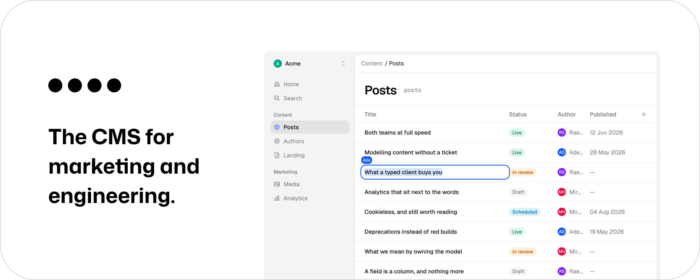

[](https://stetcms.com)

**Both teams at full speed. Neither waits, nothing breaks.**

[](https://github.com/jamiedavenport/stet/actions/workflows/ci.yml)
[](LICENSE)
[](https://docs.stetcms.com)

Stet is a CMS where marketing owns the content model and engineering gets a typed contract for it. Marketing adds a field in the UI and the developer's editor autocompletes it seconds later. Marketing deletes one and the developer's build stays green while the page keeps rendering.

Developer-first tools keep the model in the repository, so every new field is a ticket, a pull request and a deploy. Marketer-first tools keep it in a UI and hand developers an untyped API, so the first sign of a change is a broken page. Stet keeps the model in the UI and generates the contract from it.

## Demo

https://github.com/user-attachments/assets/99d8736c-eb7f-4ce6-981b-c40cbe6c5144

## The contract

`stet.gen.ts` is written by the Vite plugin from your live content model, and regenerated whenever that model changes:

```ts
import { stet } from './stet.gen';

const posts = await stet.posts.list(); // a collection
const post = await stet.posts.get('hello-world'); // one entry
const landing = await stet.landing.get(); // a map
```

Every field, its type and its options come from what marketing built. When someone deletes a field, it does not vanish from the contract:

```ts
/** @deprecated Deleted from the content model on 2026-07-31 by Ada Lovelace; entries still return the last value it held until the Action is completed. */
cover?: ContentAsset | null;
```

The key stays, the editor strikes it through, and entries keep returning its value until engineering completes the migration under Developers → Actions. Renames work the same way: the old key becomes a live deprecated alias for the new one. Generation cannot fail your build either: if it cannot reach Stet, it keeps the last file and warns.

That is the whole idea. Changes cross the gap between the two teams as information, never as breakage, and each side migrates on its own schedule.

## Features

### For content teams

- **Model content in the UI.** Collections and maps, with typed fields, options and validation. No ticket, no deploy.
- **Write together.** Live cursors and presence on the same entry, backed by CRDTs rather than a lock.
- **History and rollback.** Every change is snapshotted, and any version can be restored.
- **Bring an existing site.** Point the importer at a URL: it reads the sitemap, groups the pages, proposes a content model from what it finds, and extracts the entries.
- **Analytics on the page you just wrote.** First-party, cookieless, and routed through your own infrastructure, so there is no consent banner and nothing for an ad blocker to catch.
- **An assistant that asks first.** It reads the model, drafts and rewrites, and can take a whole task. Every write it wants to make stops for a human.
- **Search, files, roles and an audit log.** Full-text search across entries, image handling on upload, organization roles, and a record of who changed what.

### For engineers

- **A typed client, generated.** The Vite plugin keeps `stet.gen.ts` current as the model evolves; `stet generate` and `stet sync` do the same from the CLI.
- **A REST API with an OpenAPI spec.** The client is a thin wrapper over it. Content comes out as markdown and JSON.
- **Analytics you define in code.** A typed tracking plan, sent through your own backend and enriched server-side. Marketing builds dashboards on the same events.
- **Signed webhooks.** Standard Webhooks signatures, batched per organization so an editing session triggers one rebuild rather than one per keystroke.
- **An MCP server.** The assistant's tools are available to Claude, Cursor, or anything else that speaks MCP.
- **Self-hostable.** The whole thing deploys as two Cloudflare Workers on your own account.

## Deliberately not in Stet

- **No hosted preview, and no page builder.** Your application renders your content, so a preview is your own app reading through the same client. Stet manages content; building and serving the site is yours.
- **No draft/publish toggle.** Publishing states differ at every company, and a fixed one is always wrong for somebody. Model it as a field and branch on it in your app, and the workflow is the one your team actually uses.
- **No hosting.** Stet serves content through its API and clients. Where your site runs is your decision.

## Getting started

```bash
vp install
pnpm seed     # a workspace to look at, and accounts to sign in as
vp run dev    # http://localhost:3000
```

See [CONTRIBUTING.md](CONTRIBUTING.md) for the full setup and workflow, and [DEPLOY.md](DEPLOY.md) for deploying to Cloudflare. Product documentation lives at [docs.stetcms.com](https://docs.stetcms.com).

## Repository layout

| Path          | What it holds                                                             |
| ------------- | ------------------------------------------------------------------------- |
| `apps/web`    | The application and marketing site, as one Cloudflare Worker              |
| `apps/docs`   | The documentation site                                                    |
| `published/`  | The packages published to npm: client, Vite plugin, analytics, CLI        |
| `internal/`   | Workspace packages the app is built from, not published                   |
| `dogfooding/` | Stet running on Stet: the parts of the app that consume `published/`      |
| `examples/`   | TanStack Start, Next.js and Astro blogs that consume the generated client |

## Principles

- The experience is the product: superhuman UX for editors, fluent DX for engineers.
- Never break the customer's build or runtime. Sync cannot fail a build, tracking never throws, and schema changes surface as deprecations, never as errors.
- Analytics routes through the customer's infrastructure. Content delivery does not.
- The server is the trusted side. Server-provided context wins over anything the browser sends.
- The platform learns the schema from sync, not by inferring it from incoming data.
- Calm by default: light, spacious, unhurried, in both the UI and the brand.

## Contributing

Issues and pull requests are welcome. [CONTRIBUTING.md](CONTRIBUTING.md) covers the setup, the checks CI runs, and the conventions. Security reports go to [hello@jxd.dev](mailto:hello@jxd.dev) rather than a public issue: see [SECURITY.md](SECURITY.md).

## License

[Apache-2.0](LICENSE).
