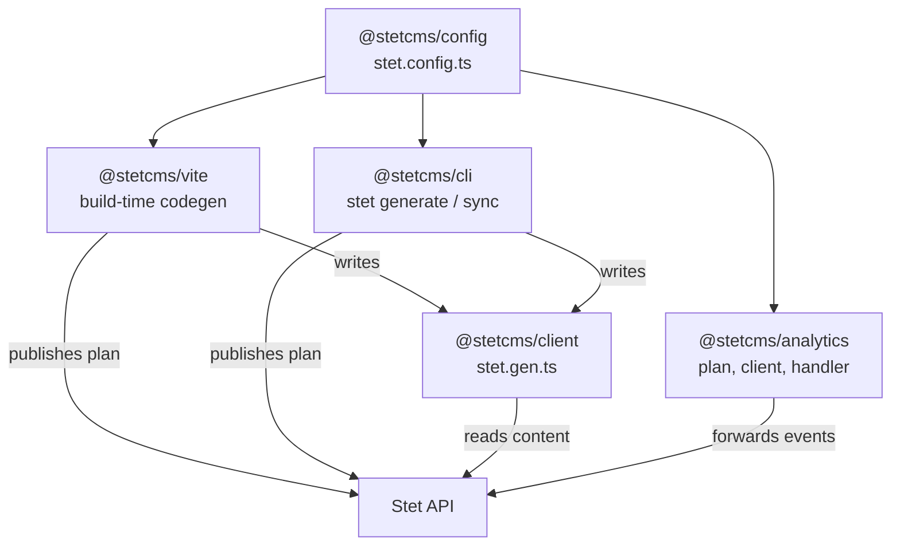

Five packages ship to npm. Each one is small and does one thing; together they
are the whole developer surface of Stet.

<CardGroup cols={2}>
  <Card title="stet.config.ts" href="/reference/configuration" icon="settings">
    `@stetcms/config` — where your Stet is, what it generates, and how every setting resolves.
  </Card>
  <Card title="Client" href="/reference/client" icon="plug">
    `@stetcms/client` — the typed content client, the REST client, and the types an entry carries.
  </Card>
  <Card title="Codegen" href="/reference/codegen" icon="wand-sparkles">
    `@stetcms/vite` — the plugin, the file it writes, and what happens when Stet is unreachable.
  </Card>
  <Card title="Analytics" href="/reference/analytics" icon="chart-bar">
    `@stetcms/analytics` — the tracking plan, the browser client, the handler, and the wire format.
  </Card>
  <Card title="CLI" href="/reference/cli" icon="terminal">
    `@stetcms/cli` — `login`, `generate`, `sync`, `org`, `whoami`.
  </Card>
  <Card title="REST API" href="/api" icon="webhook">
    The HTTP endpoints underneath all of it, generated from the contract.
  </Card>
</CardGroup>

## How they fit together

`@stetcms/config` sits at the bottom and knows nothing about the others: it
defines the shape of `stet.config.ts` and the ladder that resolves it. The
plugin and the CLI both settle their options through that ladder, which is why
they cannot disagree about which deployment you meant.

Everything above the API talks to it the same way, with an organization API key
in an `x-api-key` header — see [authentication](/api/authentication).

## Versions and stability

Every package is at `0.1.0` and moves together. Stet is pre-launch, so the
surface described here can still change; when it does, the change is described
in that package's changeset rather than shimmed.
